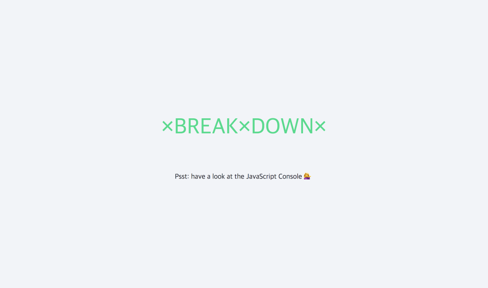

# 🖥 Console Tricks



## Regular

```javascript
console.log("hello");
```

## Interpolated

```javascript
console.log("hello I am a %s string!", "😀"); // hello I am a 😀 string!
```

## Styled

```javascript
console.log("%c I am some great text", "font-size:20px; background:#e3e3e3;");
```

## warning!

```javascript
console.warn("OH NOOO");
```

## Error :|

```javascript
console.error("OH NOOO");
```

## Info

```javascript
console.info("Crocodiles eat 3-4 people per year");
```

## Testing

```javascript
console.assert(1 === 1, "That is wrong!"); // True일 땐 아무것도 뜨지 않는다.
console.assert(1 === 2, "That is wrong!"); // Assertion failed: That is wrong!
```

## clearing

```javascript
console.clear();
```

## Viewing DOM Elements

```javascript
const p = document.querySelector("p");
console.dir(p);
```

## Grouping together

```javascript
const dogs = [
  { name: "Snickers", age: 2 },
  { name: "hugo", age: 8 },
];

dogs.forEach((dog) => {
  // console.group(`${dog.name}`);
  console.groupCollapsed(`${dog.name}`); // 닫힌 상태로 출력
  console.log(`This is ${dog.name}`);
  console.log(`${dog.name} is ${dog.age} years old`);
  console.log(`${dog.name} is ${dog.age * 7} years old`);
  console.groupEnd(`${dog.name}`);
});
```

## counting

```javascript
console.count("Test"); // Test: 1
console.count("Test"); // Test: 2
console.count("Test"); // Test: 3
console.count("New Test"); // New Test: 1
console.count("New Test"); // New Test: 2
console.count("New Test"); // New Test: 3
console.count("Test"); // Test: 4
console.count("Test"); // Test: 5
```

## timing

```javascript
console.time("fetching data");
fetch("https://api.github.com/users/ofkande")
  .then((data) => data.json())
  .then((data) => {
    console.timeEnd("fetching data");
    console.log(data); // fetching data: 177.243896484375ms
  });
```

## table

```javascript
console.table(dogs);
```
