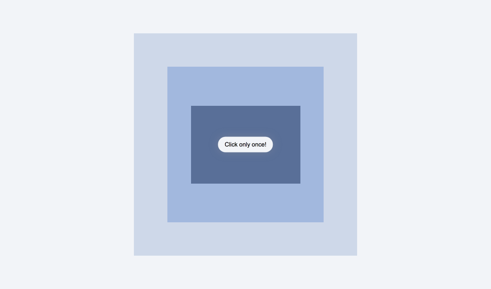

# 😯 JavaScript's Capture



## Event Bubbling

특정 화면 요소에서 이벤트가 발생했을 때 해당 이벤트가 상위의 요소로 전달되는 것을 이벤트 버블링이라고 한다.

## Event capture

Event Bubbling과 반대 방향으로 진행된다. (상위 요소 => 하위 요소)

- default value : false

```javascript
divs.forEach((div) =>
  div.addEventListener("click", logText, {
    capture: true,
  })
);
```

## e.stopPropagation( )

이벤트가 전파되는 것을 막아준다.

- **Event Bubbling** : 클릭한 요소의 이벤트만 발생시키고 상위 요소로 이벤트를 전달하지 않는다.

- **Event Capture** : 클릭한 요소의 최상위 요소 이벤트만 발생시키고 하위 요소들로 이벤트를 전달하지 않는다.

```javascript
function logText(e) {
  e.stopPropagation();
}
```

## once

이벤트를 한 번만 발생시킨다.

```javascript
button.addEventListener(
  "click",
  () => {
    console.log("clicked!");
  },
  {
    once: true,
  }
);
```
