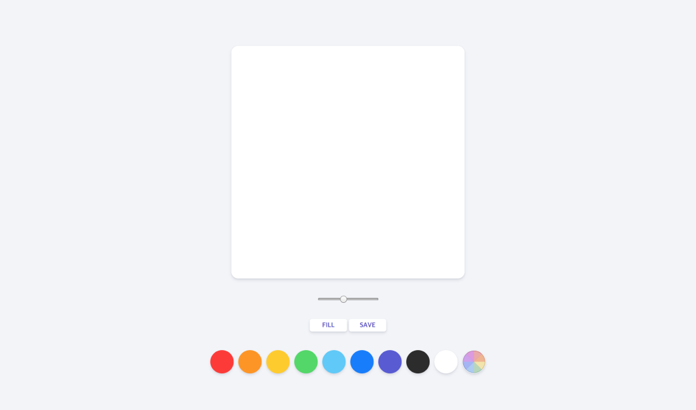

# 🎨 Let's Paint!



## About

HTML5 canvas를 이용한 그림판

## Trouble Shooting

### Rainbow Brush

❓마우스를 움직일 때 색이 계속 바뀌며 칠해져야 되는데 단일 색상으로 칠해진다.

❗️`isHue` Flag를 이용해 beginPath와 moveTo를 재설정해서 해결했다.

```javascript
if (isHue) {
  ctx.beginPath();
  ctx.moveTo(x, y);
  color = `hsl(${hue}, 100%, 70%)`;
  hue++;
}
```
