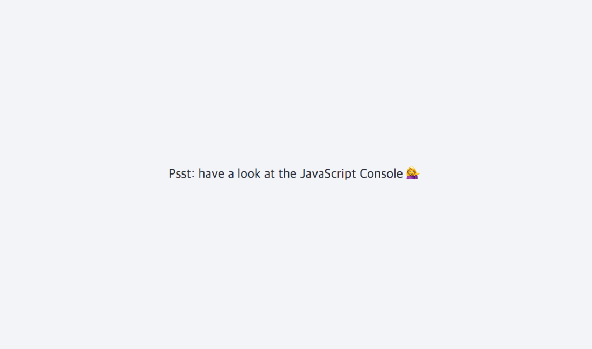

# 🧐 JS Reference VS Copy



## strings, numbers and booleans

#### copy

```javascript
// number
let age = 100;
let age2 = age;
console.log(age, age2); // 100 100
age = 200;
console.log(age, age2); // 200 100

// string
let name = "dan";
let name2 = name;
console.log(name, name2); // dan dan
name = "ofkande";
console.log(name, name2); // ofkande dan
```

## array

#### reference

```javascript
const players = ["Wes", "Sarah", "Ryan", "Poppy"];
const team = players;
console.log(players, team);
// ["Wes", "Sarah", "Ryan", "Poppy"]
// ["Wes", "Sarah", "Ryan", "Poppy"]

team[3] = "Lux";
console.log(players, team);
// ["Wes", "Sarah", "Ryan", "Lux"]
// ["Wes", "Sarah", "Ryan", "Lux"]
```

#### copy

```javascript
// 1
const team2 = players.slice();

// 2
const team3 = [].concat(players);

// 3
const team4 = [...players];
```

## object

#### reference

```javascript
const person = {
  name: "Wes Bos",
  age: 80,
};
const person2 = person;
person.name = "ofkande";
console.log(person.name, person2.name); // ofkande ofkande
```

#### copy

```javascript
// 1
const person3 = Object.assign({}, person, { number: 99, age: 20 });

// 2
const person4 = { ...person };

// 3
// Things to note - this is only 1 level deep - both for Arrays and Objects.
// lodash has a cloneDeep method, but you should think twice before using it.
const dan = {
  name: "dan",
  age: 20,
  social: {
    facebook: "dan",
    twitter: "@dan",
  },
};

const dev = Object.assign({}, dan); // copy
dev.social.twitter = "@ofkande";
console.log(dan.social.twitter, dev.social.twitter); // @ofkande @ofkande (reference)

const dev2 = JSON.parse(JSON.stringify(dan));
dev2.social.twitter = "@awesome";
console.log(dan.social.twitter, dev2.social.twitter); // @ofkande @awesome (copy)
```
