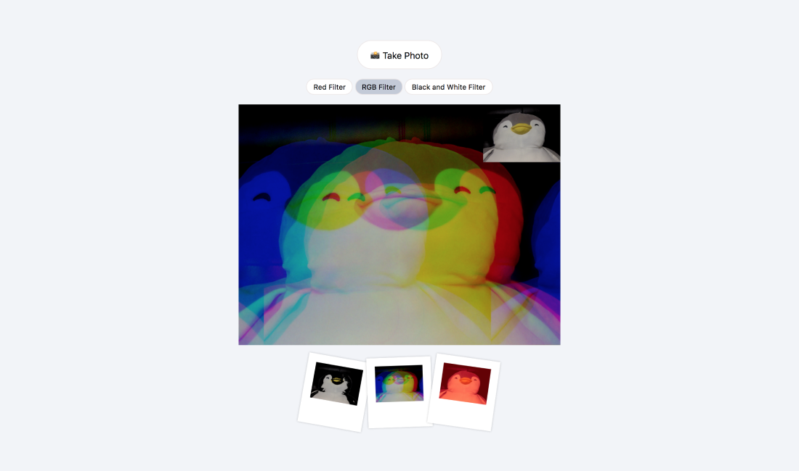
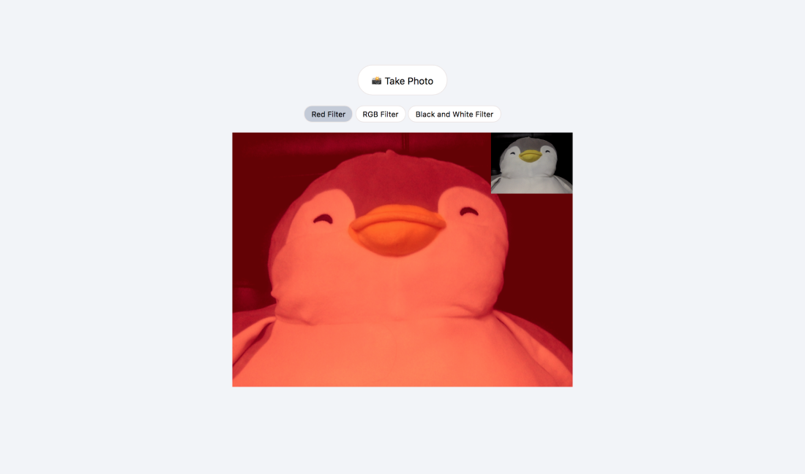

# 📸 Take photos!

## About

세 가지 필터를 선택해서 사진을 찍을 수 있다.
우측 상단에는 필터가 적용되지 않은 원본이, 큰 화면에는 필터가 적용된 모습을 확인할 수 있다.

## Trouble Shooting

### Change Filter

❓버튼을 눌렀을 때 필터의 종류를 변경하고 싶다.

❗️body의 class를 선택한 필터로 변경하고, class에 따라 필터가 바뀔 수 있도록 만들었다.
